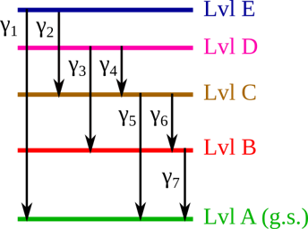
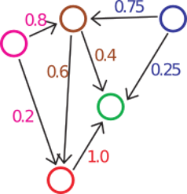
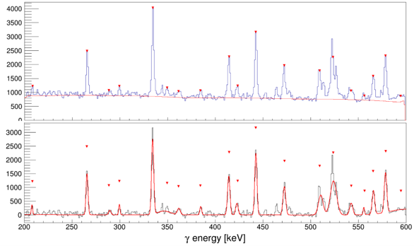
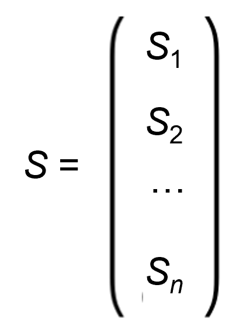
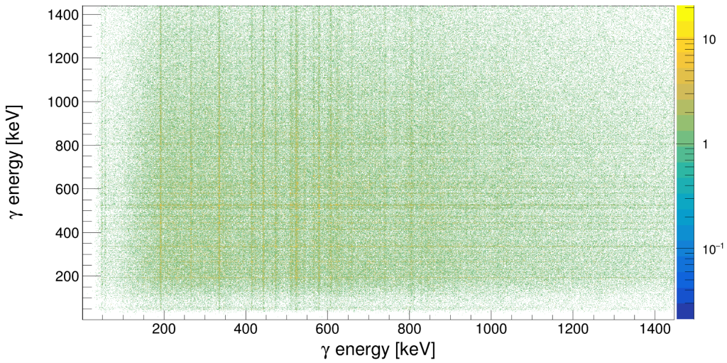
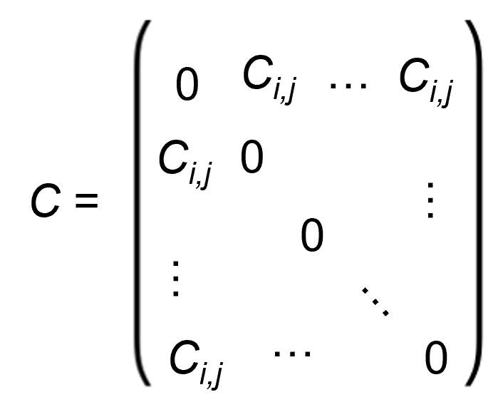
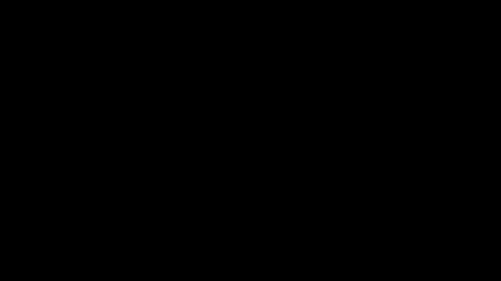

# scheme-builder-tools
Sample Code: A subset of the "Level Scheme Numerical Optimization" project, containing tools for parsing the nuclear data files, populating the relevant matrices to simulate real experimental statistics, reconstructing the nuclear level schemes in code, and drawing the graphical representation of these mathematical objects. 

# A Brief Introduction to Nuclear Terminology

Atoms are composed of a small, dense nucleus surrounded by a cloud of negatively charged electrons. Applying an electric current through a gas like neon excites the electrons to higher energy levels within the neon atoms. However, this excited electron configuration is unstable and results in the electrons decaying back down to lower energy states, releasing photons in the form of visible light. A similar process can also occur inside atomic nuclei as well but at much higher energy scales. The nucleus of an atom is composed of individual nucleons, which come in two types: (1) positively charged protons and (2) electrically neutral neutrons. The most efficiency way to arrange the constituent nucleons within a given nucleus is the one which requires the least amount of energy, also known as the $\textit{ground state}$. Different configurations of those same nucleons require more energy, and the difference between the energy required to arrange nucelons in this higher energy state and the ground state is called the $\textit{excitation energy}$ $E_x$ of that nuclear level. The properties of these excited states provide insight into the structure of atomic nuclei.

A variety of different experimental methods are employed to populate the excited states of atomic nuclei, which are beyond the scope of this document. However, common observables from all these experiments are the high-energy photons, called gamma ($\gamma$) rays, that are emitted when energetically excited nuclei decay down to their ground state configuration. This is often a multi-step process, in which many $\gamma$-rays are emitted in rapid succession. These exicted state decays usually occur so quickly that even if the emitted $\gamma$ rays are detected, they will be observed to occur basically at the same time. A ubiquitous problem in nuclear physics is the analysis of large these large $\gamma$-ray datasets and the tedious reconstruction of these decay schemes without prior knowledge of the order in which these $\gamma$ decays occur. The goal of this research project is to use numerical optimization technqiues to recover the complete $\gamma$-ray decay scheme simply from the total number of observed $\gamma$-ray transitions at each unique energy and the number of times each of these $\gamma$ rays are observed "in coincidence," i.e. the the number of times two $\gamma$ rays of different energies are observed within the same time window. Below is a simple, made-up example of how these nuclear level schemes are typically illustrated.

This toy model of a $\gamma$ decay scheme has 4 excited states and 5 nuclear levels in total, including the ground state whose excitation energy is $E_x=0$. Level E can decay via the emission of $\gamma_1$ or $\gamma_2$, populating Level A or Level C, respectively. Radiation from the nuclear transition $\gamma_2$ will either be in coincidence with $\gamma_5$ or $\gamma_6$ and $\gamma_7$, depending on the branching probabilities of this $\gamma$ cascade. Because $\gamma_1$ decay represents a transition from the highest excited state to the ground state, its observation will not be correlated with the detection of any other $\gamma$ rays in this scheme. 

## Level Schemes as Weighted, Directed Graphs

A $\textit{graph}$ is a mathematical concept used to represent a network of related objects. Each object has a corresponding $\textit{node}$ (or $\textit{vertex}$), and $\textit{edges}$ represent the relationships between nodes. It is useful to think of a $\gamma$ decay scheme as a weighted, directed graph, where the nodes correspond to the nuclear levels and the edges of the graph correspond to the $\gamma$ transitions between the levels. The edges are said to be "weighted" by the $\gamma$-ray $\textit{branching ratios}$, i.e. the probability of one excited state decaying to another nuclear level via $\gamma$ emission. The edges are also "directed" since more highly excited states can decay to less energetic nuclear levels but not the other way around. Below is an image of a weighted, directed graph corresponding to the level scheme depicted previously.

## Transition-Space and the Adjacency Matrix

Similarly, we can also represent nuclear decay sequences in "transition-centric" space. In this case, the observable $\gamma$-ray transitions are the nodes, while the exact meaning of the edges in this case is a bit more abstract. Ultimately, the existence of an edge connecting two nodes, implies that there must exist a nuclear level which is both populated by the $\gamma_i$ decay from a higher lying excited state and will decay via $\gamma_j$ emission. The weights of the edges correspond to the probability of $\gamma_j$ decay occurring immediately after $\gamma_i$ decay. The justification for representing $\gamma$ decay schemes in this unusual way is that weight of the edges connecting nodes $i$ and $j$ correspond to the elements of the $\textit{adjacency matrix}$ $A_{ij}$. The $A$ matrix has some useful mathematical properties and is ultimately the numerical solution to a system of equations that we are trying to solve subject to some physics constraints. Again, the details of these mathematics and finding the numerical solution for $A$ are beyond the scope of this sample code's documentation. The purpose of this code is calculate what $A$ should be from evaluated nuclear data, demonstrate that we can recover the level-centric decay scheme from the transition-centric $A$ matrix, and plot the graphical representation.

# The Code

Below is a brief description of the purpose and functionality of each of the files contained in this project. It also contains a walking through of an example Jupyter Notebook, which a user should reasonably be able to run on their local machine, assuming appropriate dependencies and programming environment compatibility. 

## Ta182_beta.gam and Am241.gam

These are example text files taken from evaluated nuclear data tables found on the International Atomic Energy Agency's website: https://www-nds.iaea.org/relnsd/vcharthtml/VChartHTML.html

The data files contain columns corresponding to the $\gamma$-ray energy (EG), the relative decay intensity (RI), the multipolarity of the transition (MULT), the mixing ratio (MR), the internal conversion coefficient (CC), both the parent and daughter level energies as well as their respective spins and parities. The two most important quantities for our purposes are the energies $E_{\gamma}$ of the transitions and the (relative) $\gamma$ decay intensity $I_{\gamma}$. 

## NuclearObjects.py

This file contains a variety of classes used to represent nuclear physics data structures. For example, the Gamma object is the most fundamental structure, storing information about each individual $\gamma$-ray transition. The Level object contains all incoming and outgoing Gamma objects from a particular excited state in the nucleus. The LevelScheme object contains all Level objects, which are represented by a graphical network, whose edges have corresponding Gammas. Similarly, the TransitionScheme obeject centers Gammas as the vertices within the graphical representation.

## GetMatricesSCA.py

This file contains Python codes that parses the data files and constructs the graphical representation of the level scheme. Once a consistent graph has been populated representing the level scheme, a series of functions are used to create simulated data that would ordinarily be obtained from a real experiment. The $\textit{singles}$ matrix $S$ is just a vector containing the intensities of each of the $\gamma$-ray transitions, indexed by their energy $E_{\gamma}$. and scaled by some normalization factor provided by the user.

 

Above is an example of a $\gamma$-ray energy spectrum, where the peaks have been automatically identified, the background has been estimated, and an analytical function has been used to quantify the energy and total number of observed $\gamma$ rays in each transition. For this example code, we are simply populating the $S$ matrix using the relative intensities listed in the data files, scaled by some normalization factor provided by the user.

The $\textit{undirected coincidence}$ matrix $C$ represents the analyzed result of a two-dimensional histogram from all $\gamma-\gamma$ coincidences measured in an experiment, as shown below. The elements of this matrix $C_{ij}$ (also below) are the number of times $\gamma_i$ is observed to occur at the same time as $\gamma_j$. The $A$ matrix is reconstructed from the known level structure and is populated with $\gamma$-ray branching ratios. 

 

The novel aspect of the broader research project is to numerically solve a system of equations using the $S$ and $C$ matrices to recover the adjacency matrix $A$. The example code given here populates the $A$ matrix from the data files and uses this as a jumping off point to create the TransitionScheme obect, which is then mapped to LevelScheme space using our knowledge of nuclear physics constraints. The final result is then compared to the original graph to ensure this mapping process is robust.

## Plotting.py

This Python code gives the graphical specifications for plotting graphs using the networkx package.

## LvlSchemeBuilder.ipynb

This is an example Jupyter notebook that walks through the process of parsing the text files containing the nuclear data, constructing a LSGraph object, which is used to generate the $S$, $C$, and $A$ matrices, which we would ordinarily want to get from real data, but for testing purposes are calculated from evaluated data tables. From this $A$ matrix, a series of functions are used to construct a transition-centric decay scheme graph, and imposing physics conditions, we are able to map this to level-centric space and plot the corresponding graph. This algorithm demonstrates that we can reliably reproduce the LSGraph pulled directly from the data, if the adjacency matrix $A$ is correct.
First, the text files are parsed and an LSGraph is created, representing each nuclear level as a vertex, with edges between them corresponding to $\gamma$-ray transitions. Printing the level scheme shows each level, all of its outgoing $\gamma$ rays and their properties. This LSGraph object is used to calculate the $S$, $C$, and $A$ matrices. To create TransitionScheme, we identify all the non-zero elements in the $A$ matrix, which in transition space corresponds to two nodes, connected by an edge, where row $i$ for each element is the intial transition $\gamma_i$ and column $j$ is the following transition $\gamma_j$. The number of non-zero elements in a row $i$ is the number of possible nodes $j$ that are populated following $\gamma_i$ decay. All leaf nodes are identified, i.e. $\gamma$-ray transition nodes that are populated by a previous decay but do not populate any further nodes, implying they are likely ground-state transitions. Then, we can calculate all possible paths from any $\gamma_i$ to $\gamma_j$, if they are possible.

To recover a LevelScheme from the TransitionScheme space, we loop over all edges that occur in the TransitionScheme graph and place a new node, which corresponds to a level who has both incoming and outgoing gamma rays. If a $\gamma$-ray transition does not belong to a nuclear level's existing array of outgoing $\gamma$ rays, we must make a new level, which is not populated by a more highly excited state. Similarly, if a $\gamma$-ray transition does not belong to any existing level's array of incoming $\gamma$ rays, we create a new level at the bottom of the decay scheme which likely represents the ground state or a long-lived isomeric state. Once all the nodes have been placed in the level scheme's graph, the nodes are connected by edges if the incoming $\gamma$ ray of one state matches the outgoing $\gamma$ ray of another, keeping track of any redundant nodes or edges that may be might be generated in the process of assuming no prior knowledge of the level structure. After removing all redundant nodes and edges from the graph, we create a dictionary of all possible paths from every initial excited state to every other accessible state below the initial level. Summing up the energies along each $\gamma$ cascade path gives the energy differences between all the levels. Existing levels that are approximately the same within some user-specified tolerance, are assumed to be the same excited state and are merged together.

Finally, all the candidate ground-state nodes are identified, and using the deexcitation energies and total intensity flowing into these leaf nodes, we are able to assign a ground state. All redundant leaf nodes are merged, and we are able to calculate the excitation energies relative to the ground state. The resulting level scheme can then be plotted.

